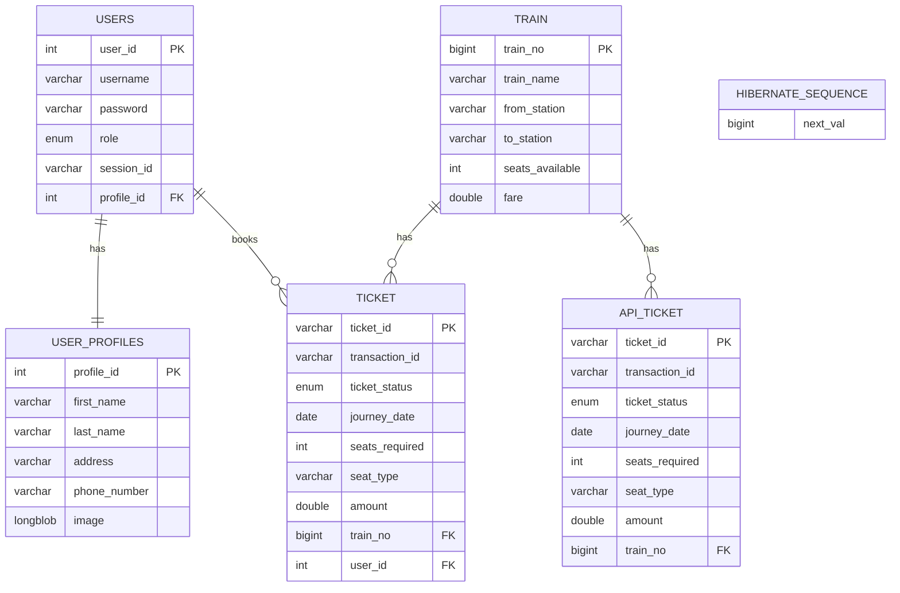

# Train Ticket Reservation System - ER Diagram

## Entity Relationship Diagram

## Entity Descriptions

### 1. USERS Entity
- **Primary Key**: `user_id` (Auto-increment)
- **Attributes**:
  - `username`: User's login username
  - `password`: User's login password
  - `role`: User role (ADMIN/CUSTOMER)
  - `session_id`: Session identifier for user sessions
  - `profile_id`: Foreign key to USER_PROFILES

### 2. USER_PROFILES Entity
- **Primary Key**: `profile_id` (Auto-increment)
- **Attributes**:
  - `first_name`: User's first name
  - `last_name`: User's last name
  - `address`: User's address
  - `phone_number`: User's contact number
  - `image`: User's profile picture (BLOB)

### 3. TRAIN Entity
- **Primary Key**: `train_no` (Auto-increment)
- **Attributes**:
  - `train_name`: Name of the train
  - `from_station`: Starting station
  - `to_station`: Destination station
  - `seats_available`: Number of available seats
  - `fare`: Ticket fare amount

### 4. TICKET Entity
- **Primary Key**: `ticket_id` (Custom generator)
- **Attributes**:
  - `transaction_id`: Payment transaction ID
  - `ticket_status`: Status (BOOKED/CANCELLED/PENDING/EXPIRED)
  - `journey_date`: Date of journey
  - `seats_required`: Number of seats booked
  - `seat_type`: Type of seat (Sleeper/AC)
  - `amount`: Ticket amount
  - `train_no`: Foreign key to TRAIN
  - `user_id`: Foreign key to USERS

### 5. API_TICKET Entity
- **Primary Key**: `ticket_id` (Custom generator)
- **Attributes**:
  - `transaction_id`: Payment transaction ID
  - `ticket_status`: Status (BOOKED/CANCELLED/PENDING/EXPIRED)
  - `journey_date`: Date of journey
  - `seats_required`: Number of seats booked
  - `seat_type`: Type of seat (Sleeper/AC)
  - `amount`: Ticket amount
  - `train_no`: Foreign key to TRAIN

### 6. HIBERNATE_SEQUENCE Entity
- **Primary Key**: `next_val`
- **Purpose**: Manages auto-generated sequence values for Hibernate

## Relationships

1. **USERS ↔ USER_PROFILES**: One-to-One relationship
   - Each user has exactly one profile
   - Each profile belongs to exactly one user

2. **TRAIN ↔ TICKET**: One-to-Many relationship
   - One train can have many tickets
   - Each ticket belongs to exactly one train

3. **USERS ↔ TICKET**: One-to-Many relationship
   - One user can book many tickets
   - Each ticket belongs to exactly one user

4. **TRAIN ↔ API_TICKET**: One-to-Many relationship
   - One train can have many API tickets
   - Each API ticket belongs to exactly one train

## Key Features

- **Dual Ticket System**: The system supports both regular tickets (linked to users) and API tickets (for external API bookings)
- **User Management**: Complete user profile management with role-based access
- **Train Management**: Comprehensive train information with seat availability tracking
- **Booking System**: Full ticket booking system with status tracking and payment integration
- **Session Management**: User session tracking for security

## Database Constraints

- All foreign key relationships are properly defined
- Primary keys are auto-generated where appropriate
- Custom ID generators are used for ticket IDs
- Proper data types and constraints are enforced 